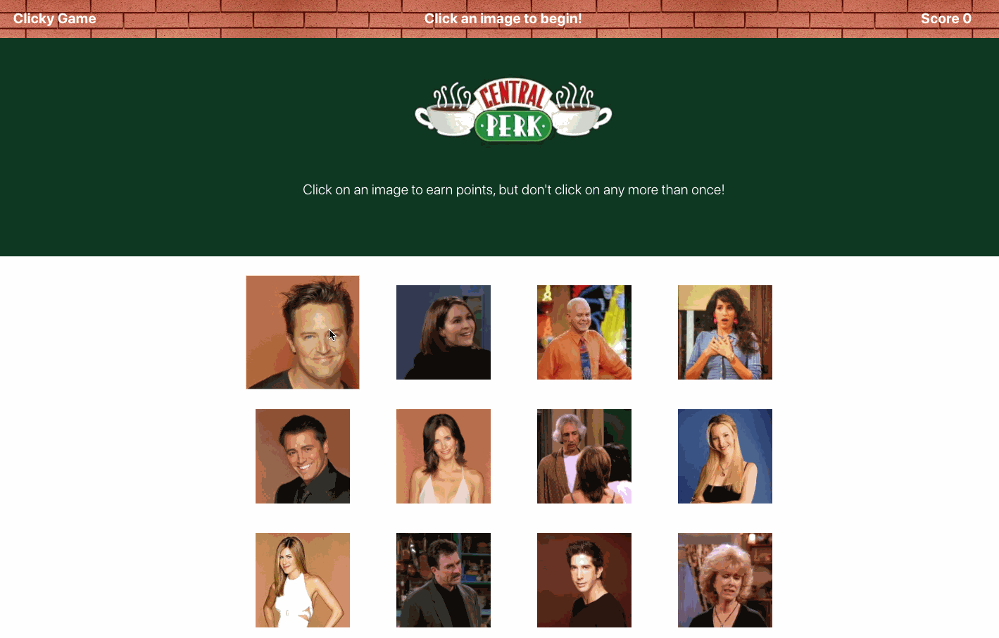

# react-clicky-game
Its a memory game with React. The application dynamically reads all images from Public folder and displays as card. On click of each image, score will be calculated. The user's score is incremented when clicking an image for the first time. The user's score is reset to 0 if same image is clicked more than once.

## Link to the deployed application
[Friends clicky game](https://liza-p.github.io/react-clicky-game/)

## Demo

## Technologies Used
- JavaScript 
- React
- Bootstrap
- css
- Git 
- GitHub - hosts repository that can be deployed to GitHub Pages
